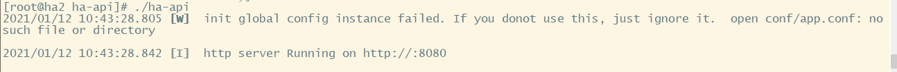
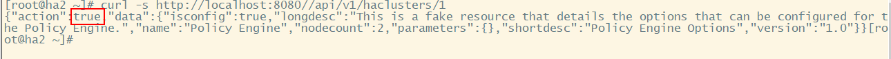

# 从源码构建

该文档描述如何从源码构建ha-api管理平台项目后端服务。

## 编译

### 构建需求

Ha-api项目后端服务编译需要在主机上安装以下包：

 - go >= 1.13
 - git
 - pam-devel
 - tar

### 构建

首先获取项目源码：

```
git clone https://gitee.com/openeuler/ha-api.git
cd ha-api/
git checkout -b release-v1.0 origin/release-v1.0
```

运行`go build`来构建项目

```
go build
```

该命令会生成`ha-api`(windows系统为`ha-api.exe`)可执行文件。

### 安装及使用

在使用ha-api后端服务之前，你需要安装HA软件。
查看[ha_install](./ha_install_en.md)文档获取更多信息。

在`tools`目录下，提供了安装脚本，用于构建ha-api可执行文件并将其与相关脚本安装到系统当中。安装完成后，通过systemd启动服务：

```
systemctl start ha-api
```



现在你可以通过REST API接口在默认的8080端口来管理你的集群。你可以使用`curl`命令来访问。

```
curl -s http://localhost:8080//api/v1/haclusters/1`
```
