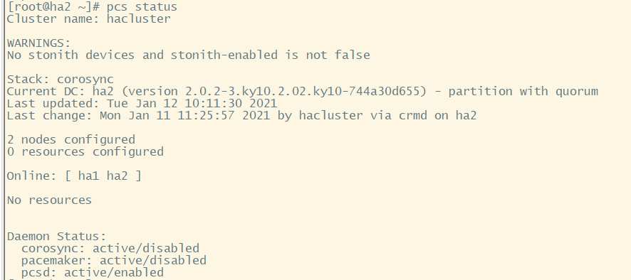

# HA 安装

本文档描述如何安装HA高可用集群软件。

## 环境要求

 - 至少两台安装openEuler 2003 LTS-SP1操作系统的物理机/虚拟机

 ## 安装步骤

 ***注意：所有集群机器均需要执行以下操作，以ha1机器为例进行说明***

 ### 修改主机名和`/etc/hosts`

 安装HA软件之前，需要确保正确配置hostname，并且在`/etc/hosts`中记录了域名解析。

 ```
[root@ha1 ~]# hostnamectl set-hostname ha1
[root@ha1 ~]# vim /etc/hosts
10.1.80.20 ha1
10.1.80.21 ha2
```

### 关闭防火墙

```
[root@ha1 ~]# systemctl stop firewalld
```

修改SELINUX配置为disabled:

```
[root@ha1 ~]# vim /etc/selinux/config
SELINUX=disabled
SELINUXTYPE=targeted
```

### install HA software

默认在OS安装之后，yum源已经正常配置，以防万一需要检查一下。文件为`/etc/yum.repos.d/openEuler.repo`，以下repo源会用到：

```
[OS]
name=OS
baseurl=http://repo.openeuler.org/openEuler-20.03-LTS-SP1/OS/$basearch/
enabled=1
gpgcheck=1
gpgkey=http://repo.openeuler.org/openEuler-20.03-LTS-SP1/OS/$basearch/RPM-GPG-KEY-openEuler

[everything]
name=everything
baseurl=http://repo.openeuler.org/openEuler-20.03-LTS-SP1/everything/$basearch/
enabled=1
gpgcheck=1
gpgkey=http://repo.openeuler.org/openEuler-20.03-LTS-SP1/everything/$basearch/RPM-GPG-KEY-openEuler

[EPOL]
name=EPOL
baseurl=http://repo.openeuler.org/openEuler-20.03-LTS-SP1/EPOL/$basearch/
enabled=1
gpgcheck=1
gpgkey=http://repo.openeuler.org/openEuler-20.03-LTS-SP1/OS/$basearch/RPM-GPG-KEY-openEuler
```

安装以下HA软件包：

```
[root@ha1~]# yum install corosync pacemaker pcs fence-agents fence-virt corosync-qdevice sbd drbd drbd-utils
```

### 设置hacluster用户密码

```
[root@ha1~]# passwd hacluster
```

### 修改配置文件 `/etc/corosync/corosync.conf`

```
totem {
        version: 2
        cluster_name: hacluster
         crypto_cipher: none
        crypto_hash: none
}
logging {         
        fileline: off
        to_stderr: yes
        to_logfile: yes
        logfile: /var/log/cluster/corosync.log
        to_syslog: yes
        debug: on
       logger_subsys {
               subsys: QUORUM
               debug: on
        }
}
quorum {
           provider: corosync_votequorum
           expected_votes: 2
           two_node: 1
       }
nodelist {
       node {
               name: ha1
               nodeid: 1
               ring0_addr: 10.1.80.21
               }
        node {
               name: ha2
               nodeid: 2
               ring0_addr: 10.1.80.22
               }
        }
```

### 启动服务

启动以下服务：

```
[root@ha1~]# systemctl start pcsd
[root@ha1~]# systemctl start pacemaker
[root@ha1~]# systemctl start corosync
```

### 节点鉴权

***注意：只需要在一台机器上执行***

```
[root@ha1~]# pcs host auth ha1 ha2
```

### 检查HA集群状态

使用`pcs status`命令检查HA集群状态。

```
[root@ha1~]# pcs status
```

